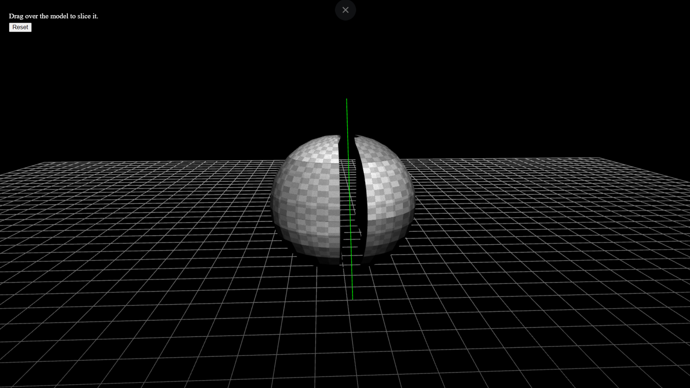

# Geometry Slicer

## Technical Details

- **Framework / Approach Used:** Raw WebGL2 with TypeScript and Vite.

- **Shading Model Used:** Lambert diffuse shading for basic light response.

- **Third-Party Libraries Used:**  
  - `glMatrix` — used for vector and matrix operations such as camera movement, model/view/projection matrices, and plane math.

- **Camera and Other Controls:** 
  - W -> Camera move Forward
  - S -> Camera move Backward
  - A -> Camera move Left
  - D -> Camera move Right
  - Z -> Camera move down
  - X -> camera move Up
  - mousemove + rightbutton -> Camera Lookat (yaw,pitch)
  - mousemove + leftbutton -> Drag to slice
  - M -> Change Meshes

- **Geometry Slicing Approach:**  

  -Drag over the model/object to slice using mouse.
  -Mouse start and end pts are used to calculate cutting plane.
  -We need to convert drag direction from screen space into world space.
  -For that first mouse pts are converted to NDC (Normalized Device Coordinates).
  -Using NDC pts raydirection is calculated using camera right, camera up, camera forward vectors.
  -Ray distance is calculated using modelWorldPosition,camera pos and dot(rayDirection, cameraForward).
  -Finally point on plane is calculated using camerapos, raydirection and raydistance.
  -plane normal is calculated as cross(dragDirectionWorld, cameraForward)
  - Each triangle of the mesh is clipped against the cutting plane to produce two output meshes.
  - The signed distance of every vertex from the cutting plane is computed using the 
    vec3.subtract(difference, vertex.position, planePoint);
    return vec3.dot(difference, planeNormal);
  - Vertices with a positive signed distance belong to the positive side of the plane, while those with a negative signed distance belong to the negative side. 
  - And we finally have two independent sliced pieces of source mesh. 

- **Incomplete areas:**
    Each piece independent selection and dragging is not yet implemented.
  